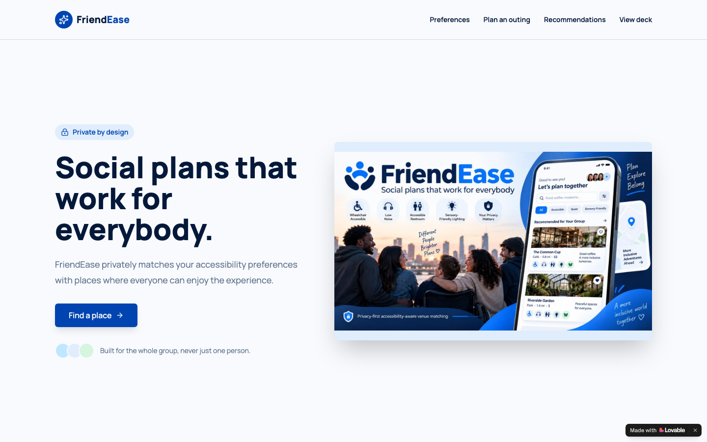
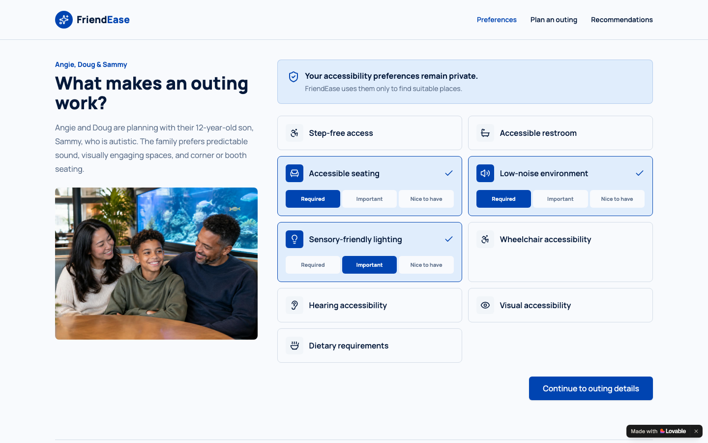
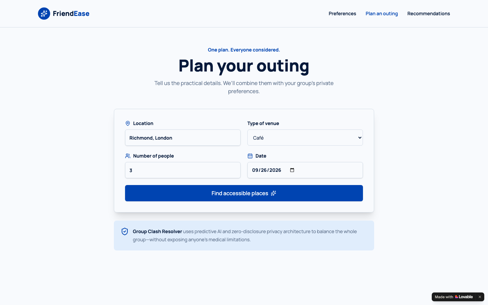
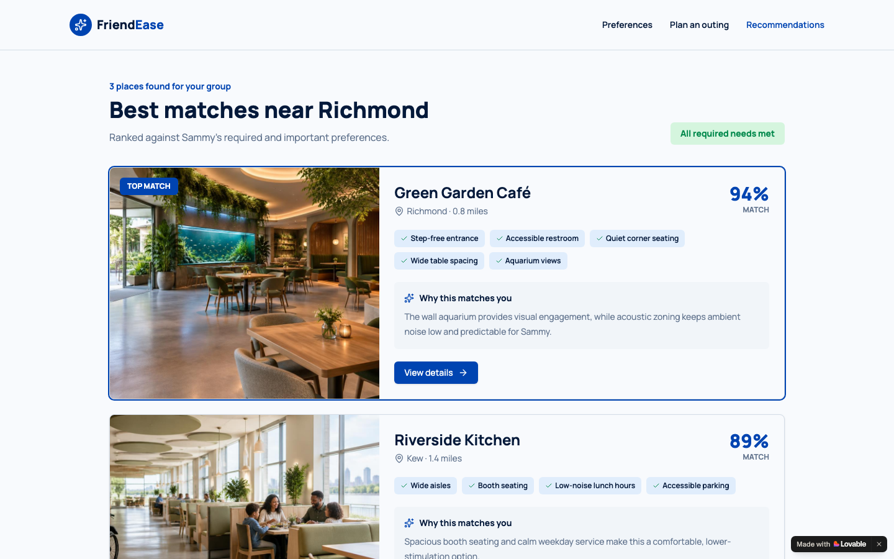
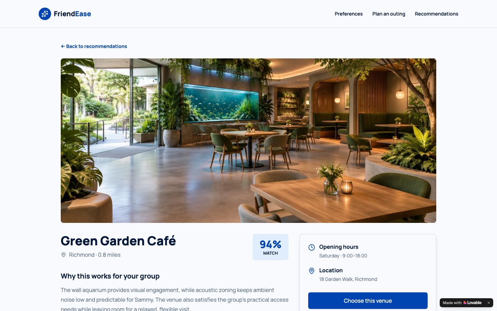

# FriendEase

**Social plans that work for everybody.**

FriendEase is a privacy-first social planning platform designed to make outings easier and more inclusive for people with accessibility and sensory needs.

**Live demo:** https://friendease-connect.lovable.app



## About FriendEase

Planning a simple dinner, café visit, or social activity can become stressful when someone has to repeatedly ask whether a venue has step-free access, accessible restrooms, suitable seating, lower noise levels, or sensory-friendly lighting. FriendEase reduces this burden by allowing users to privately select the accessibility needs that matter to them.

The platform then matches those preferences with suitable venues and presents ranked recommendations with clear explanations of why each venue is a good fit.

A key differentiator is privacy. When a user shares a selected venue with friends, FriendEase shares the plan without exposing the personal accessibility requirements that influenced the recommendation.

Our MVP demonstrates the complete journey from selecting private accessibility preferences, planning an outing, receiving accessibility-aware venue matches, reviewing match explanations, and sharing the final plan.

FriendEase aims to make inclusive social planning feel simple, respectful, and dignified — putting the ease back into friendship.

| Private preferences | Plan the outing |
|:---:|:---:|
|  |  |
| **Ranked matches** | **Venue detail and sharing** |
|  |  |

## Prototype status

This is a hackathon MVP. Venue results and match scores come from sample data in [`src/lib/venues.ts`](src/lib/venues.ts), and everything runs in the browser — there are no accounts, no database, and nothing is sent anywhere.

## Running locally

You need Node.js 22.12 or newer (20.19+ also works). Bun is optional.

```bash
git clone https://github.com/Friend-Ease/friendease.git
cd friendease
bun install        # or: npm install
bun run dev        # or: npm run dev
```

The app runs at http://localhost:8080. No environment variables are required.

The hero image is served from Lovable's asset store, so it appears only on the live demo; every other image is bundled.

## Built with

Lovable and AI-assisted development tools. Under the hood: TanStack Start (React 19), TypeScript, Vite, Tailwind CSS, and shadcn/ui.

## About this repository

This is the team's submission to the **Elevate Women Global Hackathon 2026**: the prototype's code as exported from the Lovable project where it was designed and built, plus this documentation. Development notes are in [CONTRIBUTING.md](CONTRIBUTING.md).

Built by **The FriendEase Team**.

## License

[MIT](LICENSE)
